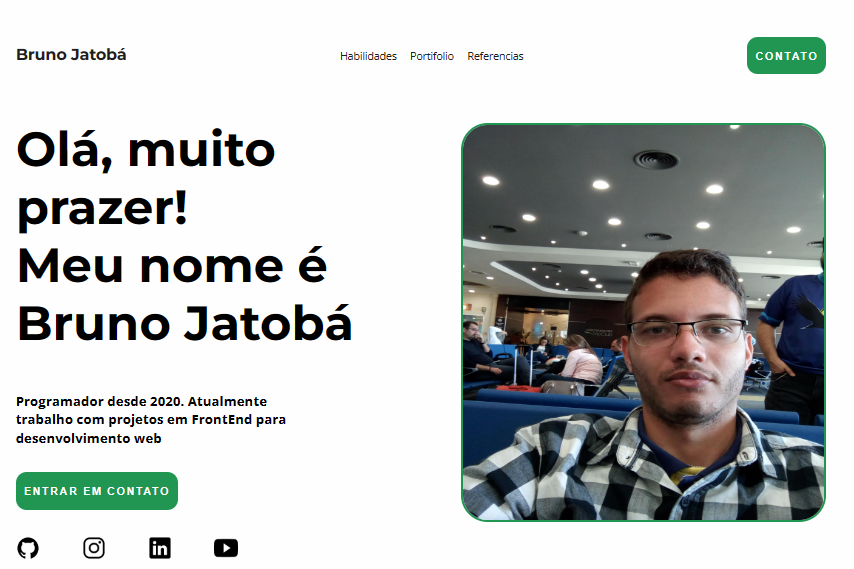

# Introduction
This repository is one exemple of build frontend web project

Initial project for the FrontEnd studies

# Preview


## Live Link
https://brjatoba92.github.io/site-portifolio/


## Aim
The aim is the development of one website using the following technologies:
- HTML
- CSS
- JavaScript

## Main concepts applied

- FlexBox
- DOM Manipulation
- Events
- CSS Media Query

## Details of sections website

The website was building in the following divisions:

1. Navegation bar: 
- Links for abilities, experiences and contact sections

2. Section hero:
- Title and show of one perfil with social media links

3. Section abilities:
- General, FrontEnd, BackEnd and DataScience abilities 

4. Section portfolio
- The aim is create link for futures projects that will development

5. Section experiences
- Show the old and present experiences

6. Section contact
- Email and number for contact

7. Footer
- End of the website page

# Instruction to run:
1. Clone the project
```
git clone git@github.com:brjatoba92/site-portifolio.git
```

2. After clone open the folder:
```
site-portifolio
```

3. Open the index file with the browser:
```
index.html
```